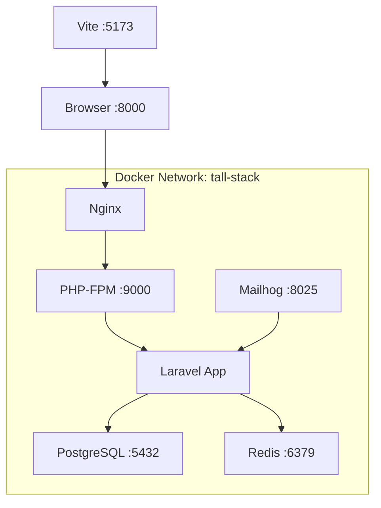

# 🛠️ Setup Técnico - Portfolio TALL Stack

## 📋 Configuração Atual Implementada

### 🐳 Docker Environment

**Containers Configurados:**
- **app**: Laravel + PHP 8.2-FPM + Nginx + Supervisor
- **postgres**: PostgreSQL 15 Alpine
- **redis**: Redis 7 Alpine para cache/sessões
- **mailhog**: Servidor email desenvolvimento
- **node**: Container desenvolvimento frontend (Vite)

**Portas Expostas:**
- `8000` → Aplicação Laravel
- `5432` → PostgreSQL  
- `6379` → Redis
- `8025` → Mailhog Web UI
- `1025` → Mailhog SMTP
- `5173` → Vite Dev Server

### 🔧 PHP Configuration

**Extensões Instaladas:**
```
- pdo, pdo_pgsql, pgsql (PostgreSQL)
- redis (Cache/Sessions)
- bcmath, pcntl (Laravel)
- zip, mbstring, xml (Core)
- gd, exif (Imagens)
- opcache, intl (Performance)
```

**Otimizações PHP (php.ini):**
```ini
memory_limit = 512M
post_max_size = 100M
upload_max_filesize = 100M
max_execution_time = 300

# OPcache habilitado
opcache.enable=1
opcache.memory_consumption=256
opcache.validate_timestamps=0

# Security
expose_php = Off
allow_url_fopen = Off
```

### 🌐 Nginx Configuration

**Características:**
- Gzip compression habilitado
- Security headers (X-Frame-Options, X-Content-Type-Options)
- Client max body size: 20M
- Static assets cache (1 year)
- FastCGI otimizado para PHP-FPM

### 📊 PostgreSQL Setup

**Configuração:**
- PostgreSQL 15 Alpine (lightweight)
- Database: `tall_stack`
- User: `sail` / Password: `password`
- Volume persistente: `postgres_data`
- Suporte para extensões (pg_trgm, etc.)

### 🚀 Supervisor Process Management

**Processos Gerenciados:**
- `nginx` - Servidor web
- `php-fpm` - PHP FastCGI Process Manager
- `laravel-worker` - Queue workers (2 processos)
- `laravel-schedule` - Task scheduler

### 📦 Build Optimization

**.dockerignore configurado:**
- Exclusão de arquivos desnecessários
- Node_modules, vendor, .git ignorados
- Logs e cache excluídos do build

**Multi-stage considerations:**
- Usuario não-root (sail) para segurança  
- Dependencies cache optimization
- Composer install --no-dev para produção

---

## 🚀 Scripts de Automação

### Makefile Commands
```bash
# Ambiente
make build      # Build containers sem cache
make up         # Start todos os serviços  
make down       # Stop todos os serviços
make status     # Status dos containers

# Laravel
make install    # Instalar Laravel + Jetstream
make shell      # Acessar container shell
make migrate    # Executar migrations
make fresh      # Fresh migration + seed

# Development
make npm-dev    # Start Vite dev server
make npm-build  # Build assets produção
make logs       # Ver logs de todos serviços

# Maintenance
make cache-clear  # Limpar todos os caches
make optimize     # Otimizar para produção
make test         # Executar test suite
```

### install-laravel.sh
Script automatizado que:
1. Instala Laravel via Composer
2. Adiciona Jetstream com Livewire
3. Instala dependências NPM
4. Compila assets iniciais
5. Gera APP_KEY
6. Executa migrations
7. Publica views do Jetstream

---

## 🔐 Environment Variables

### Configuração Atual (.env.example)
```env
# App
APP_NAME="TALL Stack Portfolio"
APP_ENV=local
APP_DEBUG=true
APP_URL=http://localhost:8000

# Database
DB_CONNECTION=pgsql
DB_HOST=postgres
DB_PORT=5432
DB_DATABASE=tall_stack
DB_USERNAME=sail
DB_PASSWORD=password

# Cache & Sessions
CACHE_DRIVER=redis
SESSION_DRIVER=redis
REDIS_HOST=redis

# Mail (Development)
MAIL_MAILER=smtp
MAIL_HOST=mailhog
MAIL_PORT=1025
MAIL_FROM_ADDRESS="noreply@tallstack.local"
```

---

## 🎯 Arquitetura de Rede



---

## ⚡ Performance Features

### Aplicação
- **OPcache**: Bytecode cache habilitado
- **Redis**: Cache de aplicação e sessões
- **Supervisor**: Process management robusto
- **Nginx**: Proxy reverso otimizado

### Database
- **PostgreSQL 15**: Performance melhorada
- **Connection pooling**: Via Laravel
- **Persistent volumes**: Dados preservados

### Assets
- **Vite**: Build tool moderno
- **Hot reload**: Desenvolvimento ágil
- **Asset optimization**: Minificação automática

---

## 🔍 Monitoring & Logs

### Logs Centralizados
```bash
# Ver todos os logs
make logs

# Logs específicos  
docker-compose logs app
docker-compose logs postgres
```

### Health Checks
- Containers com restart policy
- Supervisor monitoring processos
- Nginx health endpoint disponível

---

## 🚀 Ready for Development

**Status**: ✅ Ambiente base configurado e pronto

**Próximo passo**: Executar instalação do Laravel
```bash
make build && make up && make install
```

**Para verificar**: Acessar http://localhost:8000 após instalação